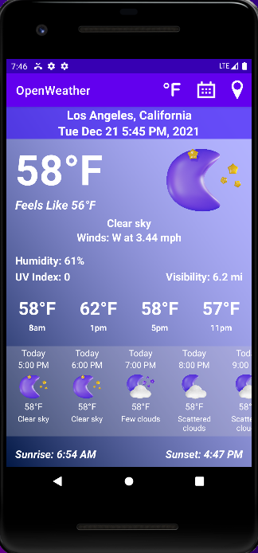
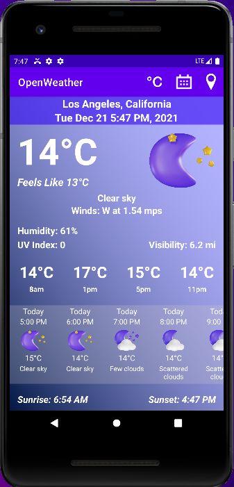
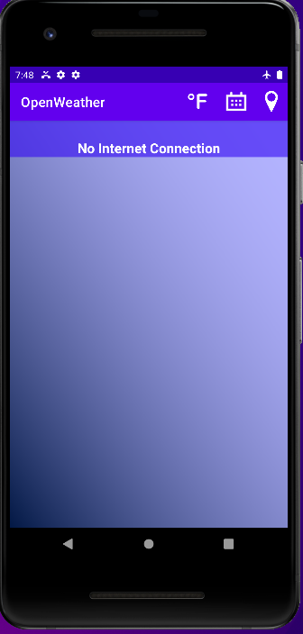
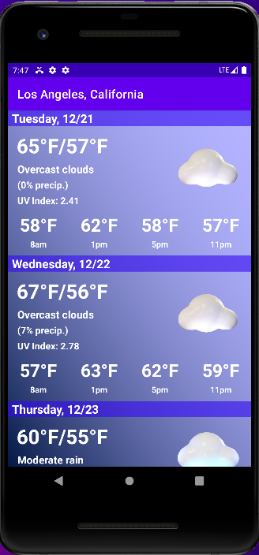

# android-weather
An Android Weather application built for my CS 442 - Mobile Application Development

## Features

### Fahrenheit/Celsius Weather

  
  

### Internet Connection

### Weekly Weather Activity

# What I Learned
* Working with APIs to fetch data
* Recycler views to show daily and weekly weather data
* onClickListeners and Intents to open calendar when specific hour is pressed to see if the user has plans
* Internet permissions and access network state to see if user has internet connection in order to communicate with API
* Using different threads with a runnable class to fetch the data more efficiently

